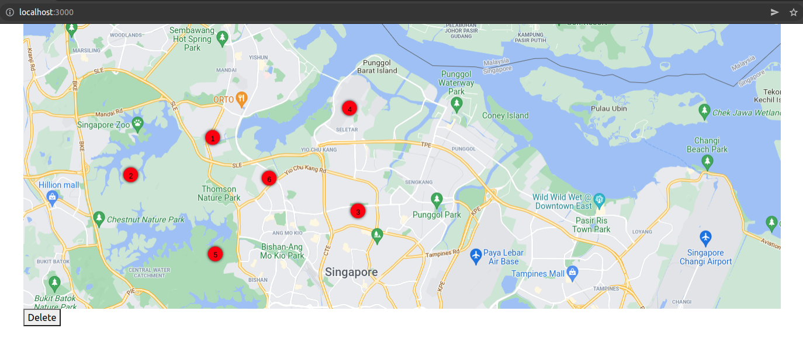

# reactjs konva add points, delete points, show points on canvas

    Nay Oo Kyaw
    nayookyaw.nok@gmail.com

* About
    This project is to manage points on canvas/ image according to x,y coordinates 
    We can add points, delete points and show/preview back these points on canvas  
    I stored these points coordinates in Localstorage temporarily  

* Live Demo   

* Video Demo   

* go to project directory 
    $ cd project/path

* Installation  
    $ npm install

* Run  
    $ npm start
